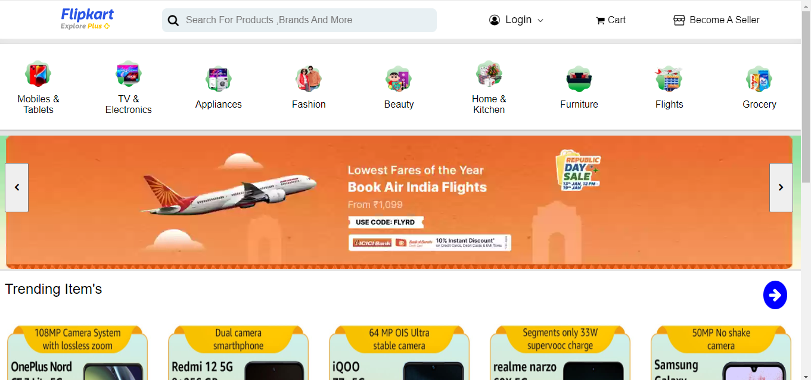
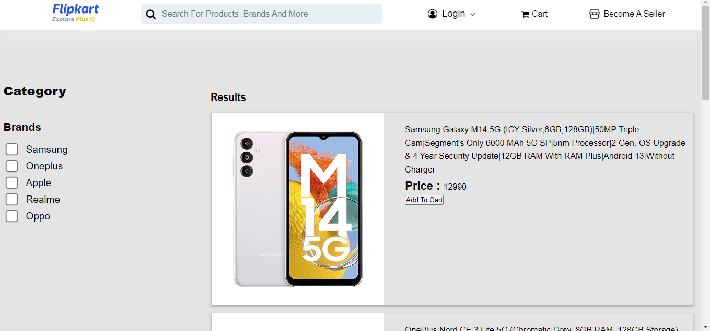
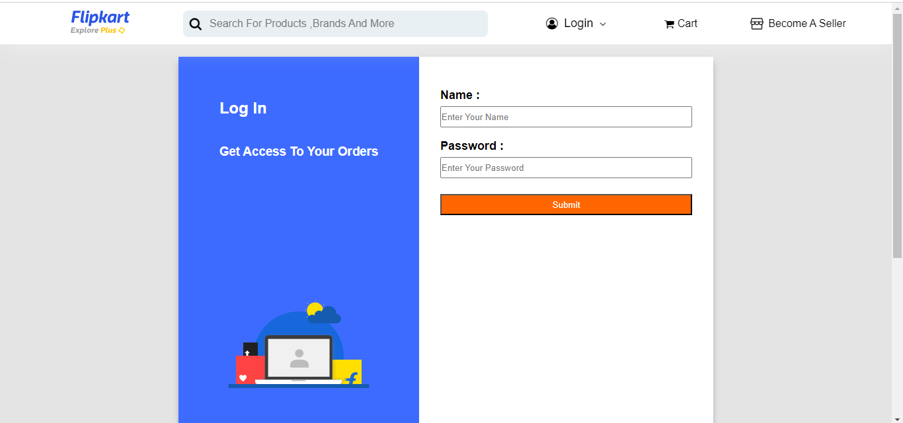
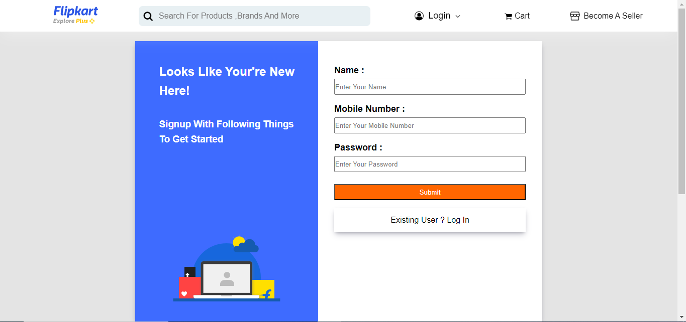
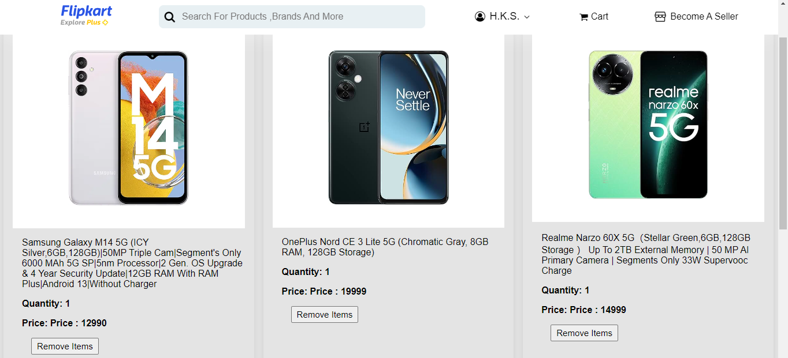

# Flipcart Clone


this is a clone of flipcart, flipcart is a ecomerce website , where you can shoping online easily.

## Live Demo

Explore the live demo: [Flipkart Clone](https://65aeb52a4dab7b3a0094a54a--superlative-blini-198462.netlify.app/)
## Acknowledgements

- Developed using [Visual Studio Code](https://code.visualstudio.com/).
- Developed with passion and dedication by " Harshit Sharma".


- Thank you for exploring this project! Your interest is greatly appreciated.

## Authors


- **Harshit Sharma**
  - GitHub: [https://github.com/HarshitSharma2250](https://github.com/HarshitSharma2250)
  - Portfolio: [my  Portfolio](https://harshitsharma2250.github.io/)
  - Email: sharma.harshit295@gmail.com


## Color Reference

| Color             | Hex                                                                |
| ----------------- | ------------------------------------------------------------------ |
| White             |  #ffffff |
| Black             |  #000000 |
| Blue              |  #0000ff |


## Deployment

To deploy this project, follow these steps:

1. Clone the repository to your local machine:

   ```bash
  - git clone https://github.com/HarshitSharma2250/FlipCart_Clone.git

  - cd FlipCart_Clone
  - npm run deploy


## Documentation

[click Documentation](https://trello.com/invite/b/I5koninY/ATTI1917aa81b0ed605f4343fe639e7deba828FFD9B2/harshit-sharma)


## Features

1. **User Authentication**
   - Users can register and log in to the application.
   - Secure user authentication mechanism using tokens.
   - Persistent login state using local storage.

2. **Page Authentication**
   - Full authentication on sensitive pages (e.g., product details, cart).
   - Users without proper authentication cannot access certain pages.

3. **Shopping Cart**
   - Users can add products to their shopping cart.
   - Cart contents persist across sessions using local storage.
   - Ability to remove products from the cart.

4. **User Dashboard**
   - Personalized user dashboard displaying relevant information.
   - Quick access to account details, order history, and other user-specific information.

5. **Responsive Design**
   - Ensures a consistent and pleasant user experience across various devices.
6. **Responsiveness**
   - this project is full responsive user can use on laptop, tablets, and mobiles 
7. **funationality**
   - authentication
   - login/sign in/sign out
   - used local storage for savinf data
   - in product i added filter  Functionality  
   - i add Functionality  to add product in cart
   - also added to remove products from cart


## Feedback

If you have any feedback, please reach out to us at sharma.harshit295@gmail.com.com


## 🚀 About Me
Hello , my name is Harshit Kumar Sharma
im a front end doveloper , and trainee at masai school plateform,

### Motivation

I embarked on this project with the goal of [to get good job and coding also my  hoby , when i write code then i feel relief ]. Whether it's solving a specific problem, exploring new technologies, or simply exercising creativity, I am excited to share this project with the community.

### Technical Stack
- **Frontend:** HTML, CSS, JavaScript


### Connect with Me

- GitHub: [HarshitSharma2250](https://github.com/HarshitSharma2250)
- LinkedIn: [Harshit Sharma](https://www.linkedin.com/in/harshit-sharma-552038236/)
- Portfolio: [Harshit Sharma](https://harshitsharma2250.github.io/)
- Twitter: [@HarshitSharma](https://twitter.com/sharmaharshit26)


## Screenshots


- this is my home page of project , i used product item bar, and img slidebar and navbar


 - this is mobile category page i use search functionallity


 - this is login page


 - this is signup  page


 - this is cart   page


## skills


**front end:** HTML,CSS,Java Script, React.js , 
